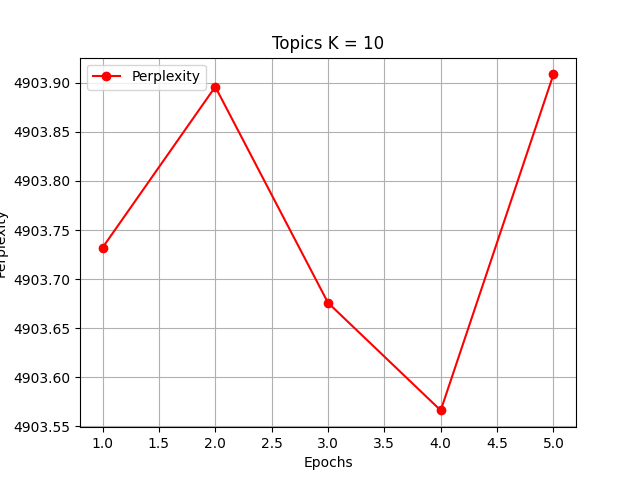
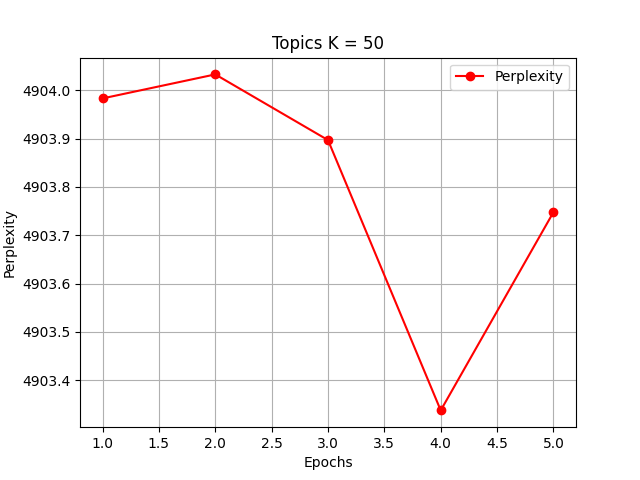
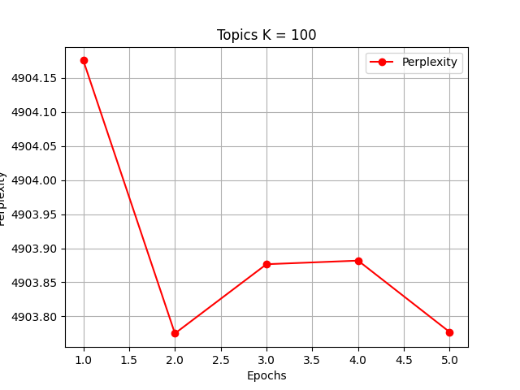

# State Space LSTM

Implementation of the Topical State Space LSTM model for text sequence analysis, as described in the paper ["State Space LSTM Models with Particle MCMC Inference"](https://arxiv.org/abs/1711.11179) by Xun Zheng et al.

## Table of Contents
- [Introduction](#introduction)
- [Features](#features)
- [Getting Started](#getting-started)
  - [Prerequisites](#prerequisites)
  - [Installation](#installation)
- [Results](#results)
  - [Dataset](#dataset)
  - [Experiment](#experiment)
  - [Plots](#plots)

## Introduction

This repository contains the implementation of the Topical State Space LSTM model, which combines the interpretability of state space models with the power of LSTMs for text sequence analysis. The model introduces topics into the LSTM framework, allowing for improved understanding of latent structures in sequential data.

## Features

- **Topical State Space LSTM Model**: Implementation of the model proposed in the paper.
- **Efficient Gibbs Inference**: Utilizes Sequential Monte Carlo (SMC) method for joint posterior sampling.
- **NLP Applications**: Adaptable for various natural language processing (NLP) tasks.

## Getting Started

### Prerequisites

- Python (>=3.6)
- Other dependencies (specified in `requirements.txt`)

### Installation

```bash
git clone https://github.com/yanisrem/SSM-Project
cd src
pip install -r requirements.txt
```

NOTE: run `load_data.ipynb` on Colab

## Results

### Dataset

IMDB dataset having 50K movie reviews for NLP or text analytics.
For more dataset information, please go through the following [link](http://ai.stanford.edu/~amaas/data/sentiment/)

### Experiment

The goal is to create a generative model. Given a sequence $(x_1, . . . , x_t)$, we want to predict $(x_{t+1}, . . . , x_T )$.
Latent variables are the topic of each word (e.g : $x_1 = 'have'$ then $z_1 = 'verb'$).

### Plots

- P = 10, number of particules
- K $\in \{ 10,50, 100\}$, number of topics
- n_epochs = 5, number of epochs
- n_iter_EM = 1 number of EM iterations
- The evaluation metric is the perplexity

<div style="text-align:center;">
  

  

  
</div>
